# Javascript Study with Dream Coding
---

## 1강. 콘솔 출력, async vs defer, use strict


###  1-1. 콘솔 출력
<br>

#### 1-1-1. 터미널에서 node 로 출력

아래와 같이 자바스크립트를 작성한다.
``` Javascript
console.log('Hello World!');
```

이후 터미널에서 파일이 있는 위치로 이동 후 __`node (파일명).js`__ 로 실행
 (_단 node js 설치를 해야 한다._)

<br>

#### 1-1-2. 웹 콘솔로 출력 (Chorme)
<br>

아래와 같이 html 파일을 작성한다.
```html
<!DOCTYPE html>
<html lang="en">
  <head>
    <meta charset="UTF-8" />
    <meta name="viewport" content="width=device-width, initial-scale=1.0" />
    <title>Document</title>
    <script src="main.js"></script>
  </head>
  <body></body>
</html>
```

이후 html을 크롬으로 실행 시킨 후 __`ctrl + shift + i`__ 로 개발자 도구를 활성화 시킨다.

개발자 도구에서 Console창을 확인한다.

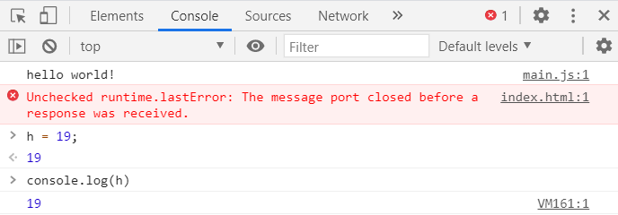


<br>

### 1-2. _async_ vs _defer_

___HTML에서 자바스크립트를 불러올 때 어떤 방식이 더 좋을까?___

* #### head 안에서 바로 블러오기

```html
<!DOCTYPE html>
<html lang="en">
  <head>
    <meta charset="UTF-8" />
    <title>Document</title>
    <script src="main.js"><script>
  </head>
  <body></body>
<html>
```
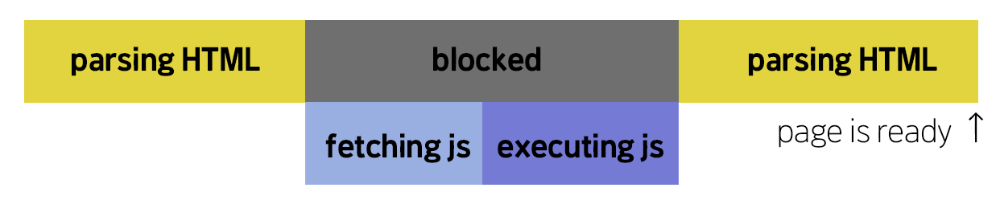

 __위 방식의 단점은, 사용자가 웹사이트를 보기 위해 시간이 오래 걸린다.__

<br>

* #### body 마지막에 불러오기
```html
<!DOCTYPE html>
<html lang="en">
  <head>
    <meta charset="UTF-8" />
    <title>Document</title>
  </head>
  <body>
    <div></div>
    <script src="main.js"></script>
  </body>
<html>
```


__위 방식의 단점은, 웹페이지가 js에 의존적이라면 정상적인 페이지를 보기까지 오래걸린다.__

<br>

* #### head에 async를 통해 불러오기

```html
<!DOCTYPE html>
<html lang="en">
  <head>
    <meta charset="UTF-8" />
    <title>Document</title>
    <script asyn src="main.js"></script>
  </head>
  <body>
    <div></div>
  </body>
<html>
```

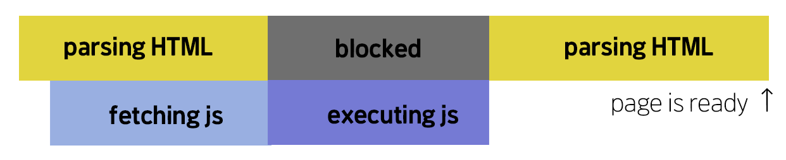

__body끝에 fetching 하기 보다 다운로드 받는 시간을 절약할 수 있다. 그러나 js가 HTML이 Parsing되기 전에 정의되지 않을 수 있고 페이지를 보기 전에 시간이 더 걸릴 수 있다.__

<br>

* #### head에 defer을 통해 불러오기

```html
<!DOCTYPE html>
<html lang="en">
  <head>
    <meta charset="UTF-8" />
    <title>Document</title>
    <script defer src="main.js"></script>
  </head>
  <body>
    <div></div>
  </body>
<html>
```

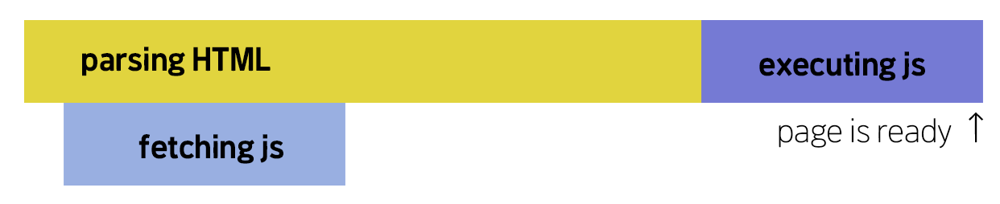

__HTML을 parsing 하는 동안 필요한 js를 받고, HTML을 모두 parsing 한 다음 js를 실행하여 사용자에게 더 빠른 컨텐츠를 제공한다.__

__만약 다수의 js들이 순서에 의존적이라면 `head + async` 보다는 `head + defer` 이 더 효율적인 방식이다.__

<br>

### 1-3. 'use strict';

자바스크립트는 특성상 유연한(flexible) 언어이기 때문에, 실수가 잦을 수 있다.
이러한 문제의 해결을 위해(?) use strict는 __ECMAscript 5__ 부터 추가되었다.


* #### use strict가 없을 시
```javascript
console.log("Hello World!");

a = 6;
```

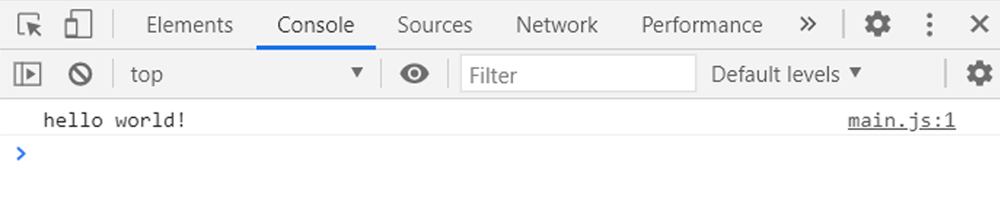

* #### use strict가 있을 시
```javascript
"use strict";

console.log("Hello World!");

a = 6;
```

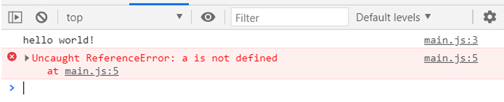

use strict로 인해 a의 선언오류를 확인 할 수 있다.
이는 `let a;` 를 `a = 6;` 윗 줄에 추가하여 수정할 수 있다.

__use strict 모드를 이용하면 조금 더 상식적인 범위 내에서 js를 이용할 수 있고, js 엔진이 더욱 효율적으로 js를 분석 할 수 있다.__


---

## 2강. 데이터타입

<br>

### 2-1. 데이터타입 종류

#### 2-1-1. let vs var

__var__ 와 __let__ 은 변수 선언 방식이다.

```Javascript
 var age;
 age = 7;
 console.log(age);
```

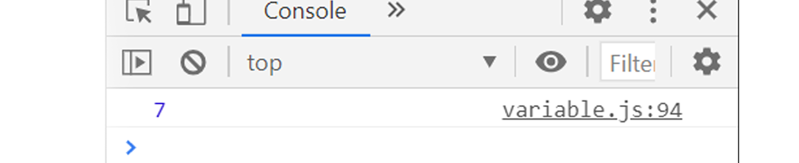

이렇게 __var__ 를 통해 변수를 선언할 수 있다.
그러나 __var__ 로 변수를 선언할 때, 아래와 같은 문제들이 발생할 수 있다.

<br>

* #####  ___Case 1___
```Javascript
  var name = 'jennie' ;
  console.log(name);
  var name = 'lisa' ;
  console.log(name);
  var name = 'jisoo' ;
  console.log(name);
```

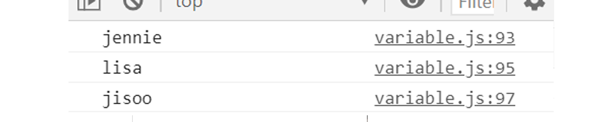

위와 같이 __var__ 로 변수를 선언을 하면 이전에 무엇으로 선언하였든 상관없이 매번 변수가 새로 선언된다.

이로 인해 실수로 변수선언을 아래에서 새로 하면 <u>위에서 오류가 발생할 수 있다.</u>

<br>

* ##### ___Case 2___
```Javascript
  age = 4;
  var age;
  console.log(age);
```

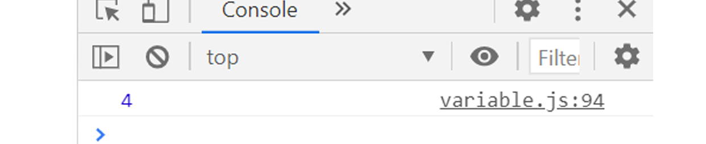

__var__ 은 어느위치에서 변수를 선언하여도 가장 위에서 선언되는 문제가 생긴다.

이러한 현상을 ___호이스팅(Hoisting)___ 이라 부른다.

<br>

이를 해결하기 위해 __let__ 이 생겨났다!
__let__ 은 ES6부터 추가된 변수 선언 방식이다. 아래처럼 변수를 선언하면 된다.

```Javascript
  let age;
  age = 10;
  console.log(age);
```
사실 변수선언은 __let__ 이나 __var__ 이나 똑같다... :/
하지만 __let__ 을 쓰는 이유는 아래와 같다.

* ##### _새로 갱신되지 않는 선언_
```Javascript
  let name = 'jennie';
  console.log(name);
  let name = 'jisoo';
  console.log(name);
```

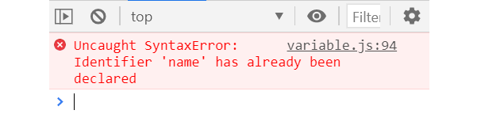

이처럼 __let__ 으로 변수를 선언하면 이후 추가로 선언하더라도 갱신되지 않는다.

만약 name을 새로 갱신하고싶으면 아래처럼 선언하자.

```javascript
let name = "jennie";
console.log(name);
name = "jisoo";
console.log(name);
```
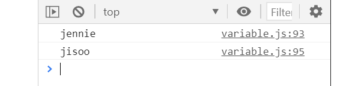

* ##### _Block-scope_

__var__ 은  이랑 달리 __let__ 은 `block-scope` 이다.
`block-scope`란 `{ block }` 안의 범위를 의미한다.

즉, `block-scope` 안에서 선언된 변수는 밖에서 호출될 수 없다.

```javascript
  {
    let group = "Blackpink";
    console.log(group);
  }
  console.log(group);
```


만약 특정 변수를 `block` 안에서도 사용하고 싶다면 `block` 밖에서 작업하면 된다.

```javascript
  let globalGroup = 'BTS';
  {
    let blockGroup = 'Twice';
    console.log(globalGroup);
    console.log(blockGroup);
  }
  console.log(globalGroup);
  console.log(blockGroup);
```
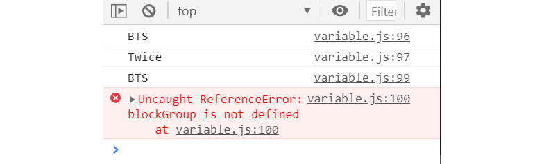

`global-scope(전역 스코프)` 에서 선언된 `globalGroup` 은 `block-scope` 안에서도 불러올 수 있지만, `block-scope` 에서 선언된 `blockGroup` 은 `block` 밖에서 정의되지 않아 불러올 수 없다.

<br>

#### 2-1-2. const

<br>

__const__ 또한 __var__ 을 보완하기 위해 추가된 변수 선언 방식이다.
__const__ 가 __let__ 과 다른 점은 `immutable` 여부 차이이다. (참고로, `immutable` 은 변하지 않는 속성을 의미한다.)

위에서 __let__ 은 재할당이 가능하다 설명했으나, __const__는 그것이 불가능하다.

```Javascript
  let name1 = 'jisoo';
  const name2 = 'lisa';
  console.log(name1, name2);

  name1 = 'jennie';
  name2 = 'rose';
  console.log(name1, name2);
```

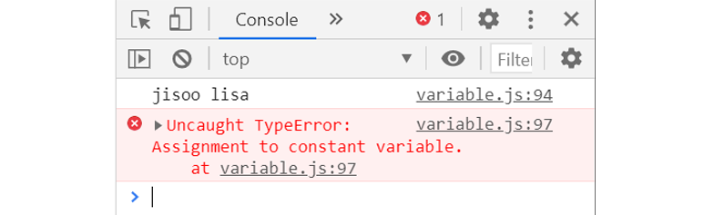

위와 같이 __`Assignment to constant variable`__ 이라는 오류가 발생한다.
이와 같이 __const__ 는 변수 재선언 및 재할당이 불가하다.

그렇다면 우리는 변수를 어떻게 선언해야 좋을까?

* 첫번째로 __const__ 로 변수를 선언하는것이 좋다.
* 두번째로 만약 재할당이 필요한 변수가 있다면 __let__ 을 쓰자.
* 참고로 변수에 재할당이 필요한 경우는 드물다고 하니 __let__ 을 쓸 일이 얼마나 될까 싶다.
* __var__ 은 걍 버리면 될듯. __const__ 를 사랑하라.


<br>

### 2-2. 데이터 타입

<br>

#### 2-2-1. Javascript = Dynamic?

<br>

자바스크립트는 `동적(Dynamic) 언어` 이다.
`동적 언어` 란 변수의 데이터타입을 미리 선언할 필요가 없다. 가령 c언어에서는 아래와 같이 데이터타입을 선언한다.


``` c
int main (){
  short a = 12
  int b = 12;
  long c =　1234;  
  float d =  1.2f;
  double e = 8.2;
  return 0;
}
```

그러나 자바스크립트는 프로그램이 처리되면서 자동적으로 파악된다.
이것은 같은 변수더라도 계속해서 _<u>데이터 타입을 바꿀 수 있다.</u>_

``` javascript
  let a = 12;
  console.log(`Value : ${a}, Type: ${typeof a} `);

  a = 'Blackpink';
  console.log(`Value : ${a}, Type: ${typeof a} `);

  a = true;
  console.log(`Value : ${a}, Type: ${typeof a} `);
  ```
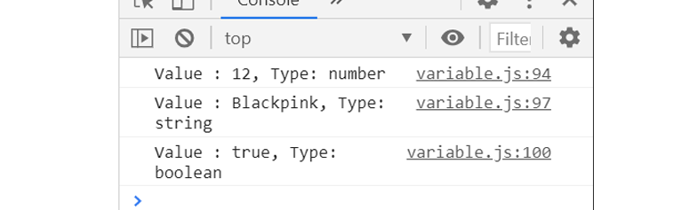

아래에 간단하게 자바스크립트의 데이터 타입을 정리해보겠다

* ___Javascript's Data Types___
  * __Boolean__ : 논리적 요소. `true` 와 `false`두 가지 값을 가진다.

  * __Null__ : Null 타입은 오직 `null` 만 가질 수 있다. 의도적으로 비어있는 값을 의미한다.

  * __Undefined__ : 값을 할당하지 않은 변수는 `undefined` 값을 갖는다.

  * __Number__ : 숫자값들은 모두 `number` 값을 가진다. 추가적으로 `Infinity` , `-Infinity` , `NaN` 이라는 특수한 값도 표현된다.

  ``` javascript
    let numberType1 = 23;            // 정수 형태
    console.log(`Value : ${numberType1}, Type: ${typeof numberType1} `);
    let nunmberType2 = 15.23;        // 소수 형태
    console.log(`Value : ${nunmberType2}, Type: ${typeof nunmberType2} `);
    let infinity = 1 / 0;            // 무한대
    console.log(`Value : ${infinity}, Type: ${typeof infinity} `);
    let negativeInfinity = -1 / 0;   // -무한대
    console.log(`Value : ${negativeInfinity}, Type: ${typeof negativeInfinity} `);
    let notNumber = 1 / 'jisoo';     // NaN
    console.log(`Value : ${notNumber}, Type: ${typeof notNumber} `);
  ```

  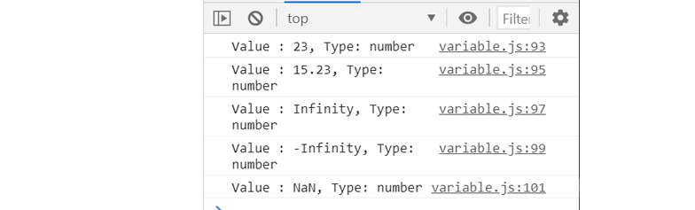
   위와 같이 모두 `number` 타입을 갖는다.

  * __String__ : 텍스트 데이터 타입이다. `string` 의 첫 번째 요소는 0번 인덱스이고, 그 다음 요소부터 1번, 2번 ... 의 요소이다

  ``` javascript
    let jisoo = 'jisoo' ;
    console.log(jisoo[0], jisoo[3]);
  ```
  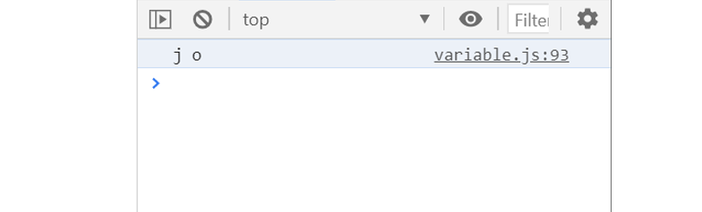
1번째 요소가 0번 인덱스인 `jisoo[0]` 이고, 4번째 요소가 3번 인덱스인 `jisoo[3]` 이다.
  또 _'문자열의 자료형화'_ 를 조심해야 하는데, 그 이유는 일단 나중에 알게될 것이다. ___문자열은 문자열 그대로 쓰자___

  <br>

  * __Symbol__ : `symbol` 은 객체 속성을 만들 수 있는 변경이 불가능(immutable)한 원시 데이터 형식(primitive) 이다. `symbol` 은 기본적으로 같은 string값이어도 서로 같지 않다.
  따라서 `symbol` 은 고유한 식별자를 만들때 주로 사용된다.

    ``` javascript
      const symbol1 = Symbol('jisoo');
      const symbol2 = Symbol('jisoo');

      console.log(symbol1 === symbol2);
    ```
    
    만약 같은 `string` 값을 가질 때 서로 같은 `symbol` 로 만들고 싶다면 아래와 같이 작성하자.

    ```javascript
      const symbol1 = Symbol.for('jisoo');
      const symbol2 = Symbol.for('jisoo');

      console.log(symbol1 === symbol2);
    ```
    
   또한, 객체 속성의 key 값으로도 사용이 가능하다.


<br>

#### 2-2-2. 객체(Object)

<br>
