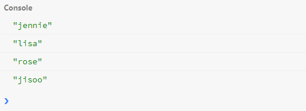
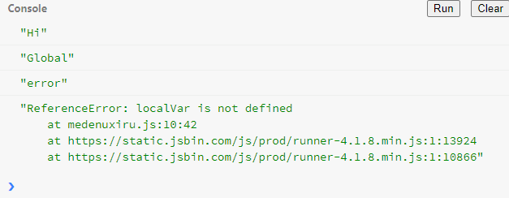
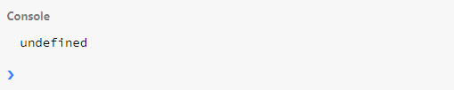
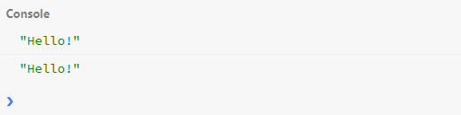
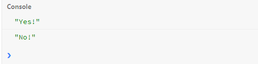

## 4강. 함수 기초편 (Function - basic level)

---

### 4-1. 함수(function)

  #### 4-1-1. 함수란?

  일반적으로 함수는 함수 외부 코드에 의해 호출될 수 있는 _하위프로그램_ 이다.

  

  자바스크립트에서 함수는 `function name(param1, param2) {body ... return;}` 으로 정의된다. 아래와 같이 `Hello` 를 출력하는 함수를 만들 수 있다.

  ``` javascript
    function printHello(){
      console.log('Hello');
    }

    printHello();

  ```
  

  자바스크립트에서 함수는 `Function`객체 이다. (아직 객체에 대해 제대로 다루지 않았기에 이후 객체를 배우면 이게 얼마나 중요한지 이해되지 않을까?) 함수로 객체의 속성을 바꿀 수 있다.

  ``` javascript
    function memberChanger(member) {
      member.member1 = 'jisoo';
      console.log(member);
    }

    let blackpink = {
      name : 'blackpink',
      member1 : 'jihyo',
      member2 : 'jennie',
      member3 : 'lisa',
      member4 : 'rose'
    };

    memberChanger(blackpink);
  ```
  

  이처럼 변수 `blackpink` 에 객체를 할당하였고, `blackpink.member1` 이 `jihyo` 였으나 함수 `memberChanger` 로 `member1`의 객체속성을 `jisoo` 로 변경 하였다.

  함수를 만들 때 주의해야할 사항은 다음과 같다.

    1. 하나의 함수는 하나의 일만 하도록 하자
    2. 함수 이름은 동사형태로, 일을 의미하게 쓰자

  하나의 함수로 여러가지 일을 하려 하는 것 보다 여러개의 함수로 나누는것이 더욱 효율적이다!

  ``` javascript
  function createNameAndAge (){} // 두개의 일을 하도록 생성된 함수, 비효율적.

  function createName (){}
  function createAge (){} // 두개로 나누는것이 효율적이다.
  ```

<br>

### 4-2. 매개변수 (Parameters)

  매개변수는 함수의 정의에서 전달받은 인수를 함수 내부로 전달하기 위해 사용되는 변수이다.

  ``` javascript
    function sumNum(x,y) {
      return x + y;
    }

    console.log(sumNum (4,6));
  ```
  

  매개변수에는 `primitive parameter` 와 `object parameter` 이 있다.`primitive parameter`의 경우 위 예시와 같이 매개변수를 값 자체로 주고받는다.  
  그러나 `object parameter` 은 객체 이기 때문에 `reference`를 주고받는다. 위의 `memberChanger(member)` 함수의 경우가 이에 해당한다.

  - #### Default Parameters
  ```javascript

    function showMessage(message,from){
      console.log(`${message} by ${from}`)
    };

    showMessage('Hi!');
  ```
  

  위와 같이 매개변수가 지정되지 않으면 `undefined` 로 출력된다. 이를 해결하기 위해선 아래와 같이 `if`문 을 추가해야했다.

  ```javascript
    function showMessage(message,from){
      if (from == undefined) {
        from = 'unknown'
      };
      console.log(`${message} by ${from}`)
    };

    showMessage('Hi!');
  ```
  이를 해결하기 위해 ES6에서 `Default Parameter` 가 추가되었다. 아래처럼 간단하게 작성해서 불필요한 `if`문을 사용하지 않을 수 있다.

  ```javascript
    function showMessage (message, from = 'unknown'){
      console.log(`${message} by ${from}`)
    };

    showMessage ('Hi!');
  ```
  

  - #### Rest Parameters

  매개변수를 배열형태 `...` 로 받는것을 `Rest Parameter` 라고 한다. 아래 코드를 보자.

  ``` javascript
    function printAll(...args) {
      for (let i =0; i < args.length; i++) {
        console.log(args[i]);
      };
    };

    printAll('jennie', 'lisa', 'rose', 'jisoo');
  ```
  

  언제 쓰는지는 잘 모르겠다. 함수에 많은 매개변수를 넣을 때 필요하지 않을까? ㅎㅎ;;


### 4-3. Local Scope

  __`밖에서는 안이 보이지 않고 안에서만 밖을 볼 수 있다.`__

  이것만 기억하면 된다는데, 솔직히 이게 더 이해가 안되는 말이었다. 그냥 `Local Variable(지역변수)` 는 `Local` 에서만 쓰일 수 있고, 그 이상의 범위에서는 쓸 수 없다. 아래 코드를 보자.

  ```Javascript
    let globalVar = 'Global';       // global scope

    function printVar () {
      let localVar = 'Hi';          // local scope
      console.log(localVar);
      console.log(globalVar);
    }

    printVar();                     // printVar 실행
    console.log(localVar);          // Error!
  ```
  

### 4-4. Return a value

  모든 함수는 함수의 결과값을 `return` 한다. return을 설정한 아래 코드를 보자.

  ```javascript
    function sumAll (a, b, c) {
      return a + b + c ;
    }

    console.log(sumAll(1,2,3));
  ```

  위 코드에서는 `a + b + c` 을 `return` 하기에 `6` 이 출력된다. 만약 여기서 `return` 을 없애면 어떻게 출력될까?

  ```javascript
    function sumAll (a, b, c) {
    }

    console.log(sumAll(1,2,3));
  ```
  

  이로써 알수 있는것은, 함수에서 `return` 을 따로 작성안하면 기본적으로 `return undefined` 로 설정된다.

  만약 코딩을 할 때 아래의 코드같이 긴 로직을 작성할 때, return 을 적극사용하지 않으면 비효율적일 수 있다.

  ```javascript
    function longLogic(par) {
      if (par.num > 10) {
        // Long and hard logic
        // 계속된 조건문으로 가독성 떨어질 수 있음
      }
    }         // bad!

    function longLogic2(par){
      if (par.num <= 10) {
        return;
      }
      // long and hard logic
    }          //맞지 않는 조건문을 빠르게 return 하여 효율적인 로직을 작성 할 수 있다.
  ```

  사실 이건 내가 경험이 부족해서 뭔소린가 싶긴한데, 계속 하다보면 이해될 내용일 듯 하다. 넘어가자 지금은 ㅎㅎ;

### 4-5. Function Expression (함수 표현식)

  함수표현식은 변수에 함수를 저장하여 변수로 함수를 부를 수 있는 방법으로, 자바스크립트의 특징 중 하나이다.

  ``` Javascript  
    const sumNum = function (a,b) { return a + b};

    console.log(sumNum(2,4));
  ```
  

  자바스크립트의 함수는 호이스팅(Hoisting) 이 가능하다. 아래 코드를 보자.

  ``` javascript
    printHello();

    function printHello () {
      console.log("Hello!");
    }

    printHello();
  ```
  

  하지만 함수표현식은 호이스팅이 적용되지 않는다. 따라서 불필요한 호이스팅을 방지하기 위해 간단한 함수들은 함수표현식을 사용하자. (~~더글라스 크락포드성께서도 그리 알려주셨다!~~)

  - #### Arrow Function

  `Arrow function` 은 자바스크립트만의 함수 선언 방식이다. 아래의 구조를 가진다.

  ``` javascript
  const variable = (parameter) => {
    function code;
    return value;
    }
  ```
  이걸 이용해서 간단한 함수를 만들어보자.

  ```javascript
    const sumNum = (a, b) => {
      return a+b;
    };

    console.log(sumNum(1,3));
  ```
  

  여기서 더 간단하게 하면

  ```javascript
    const sumNum = (a, b) => a + b;

    console.log(sumNum(1,3));
  ```
  

  로 동일하게 출력된다. 효율적 코딩을 위해 열심히 연마하자


### 4-4. Callback function

  콜백 함수 (Callback Function) 은 __어떤 이벤트가 발생한 경우, 실행되는 함수__ 이다. 아래 구문을 보자

  ```Javascript
    function randomQuiz (answer, printYes, printNo) {
      if (answer == 'love you') {
        printYes();
      }  else {
        printNo();
      }
    }

    const printYes = function () {
      console.log('Yes!');
    }

    const printNo = function print() {
      console.log('No!');
    }

    randomQuiz('love you', printYes, printNo);
    randomQuiz('hate you', printYes, printNo);
  ```
  

  위 처럼 `randomQuiz` 함수에서 이벤트를 통해 `printYes` 또는 `printNo` 함수가 호출된다. 이를 콜백 함수라고 부른다.

  그렇다면 콜백 함수는 왜 쓰는 걸까? 본 강의에서 나오지는 않았지만 그 이유는 비동기처리 코딩을 위해서라고 한다. 이후 강의에서 비동기 코딩에 대해 나오니 기대하고 있자!   

  간단하게 찾아본 비동기처리란 _특정 코드의 연산이 끝날 때 까지 코드의 실행을 멈추지 않고 다음 코드를 먼저 실행하는 자바스크립트의 특성_ 이라고 한다. (출처 : https://joshua1988.github.io/web-development/javascript/javascript-asynchronous-operation/)
