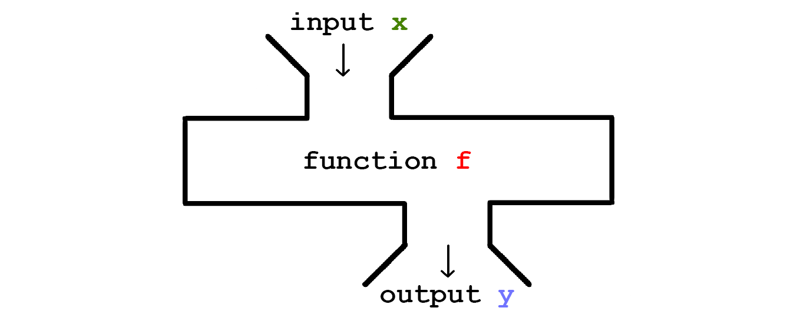
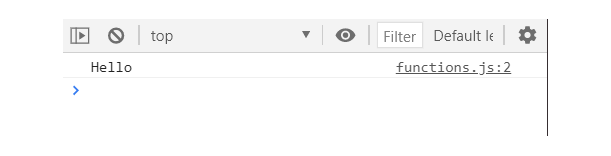
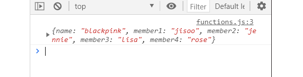

## 4강. 함수 기초편 (Function - basic level)

---

### 4-1. 함수(function)

  #### 4-1-1. 함수란?

  일반적으로 함수는 함수 외부 코드에 의해 호출될 수 있는 _하위프로그램_ 이다.

  

  자바스크립트에서 함수는 `function name(param1, param2) {body ... return;}` 으로 정의된다. 아래와 같이 `Hello` 를 출력하는 함수를 만들 수 있다.

  ``` javascript
    function printHello(){
      console.log('Hello');
    }

    printHello();

  ```
  

  자바스크립트에서 함수는 `Function`객체 이다. (아직 객체에 대해 제대로 다루지 않았기에 이후 객체를 배우면 이게 얼마나 중요한지 이해되지 않을까?) 함수로 객체의 속성을 바꿀 수 있다.

  ``` javascript
    function memberChanger(member) {
      member.member1 = 'jisoo';
      console.log(member);
    }

    let blackpink = {
      name : 'blackpink',
      member1 : 'jihyo',
      member2 : 'jennie',
      member3 : 'lisa',
      member4 : 'rose'
    };

    memberChanger(blackpink);
  ```
  

  이처럼 변수 `blackpink` 에 객체를 할당하였고, `blackpink.member1` 이 `jihyo` 였으나 함수 `memberChanger` 로 `member1`의 객체속성을 `jisoo` 로 변경 하였다.

  함수를 만들 때 주의해야할 사항은 다음과 같다.

    1. 하나의 함수는 하나의 일만 하도록 하자
    2. 함수 이름은 동사형태로, 일을 의미하게 쓰자

  하나의 함수로 여러가지 일을 하려 하는 것 보다 여러개의 함수로 나누는것이 더욱 효율적이다!

  ``` javascript
  function createNameAndAge (){} // 두개의 일을 하도록 생성된 함수, 비효율적.

  function createName (){}
  function createAge (){} // 두개로 나누는것이 효율적이다.
  ```

<br>

### 4-2. 매개변수 (Parameters)

  매개변수는 함수의 정의에서 전달받은 인수를 함수 내부로 전달하기 위해 사용되는 변수이다.

  ``` javascript
    function sumNum(x,y) {
      return x + y;
    }

    console.log(sumNum (4,6));
  ```
