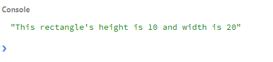
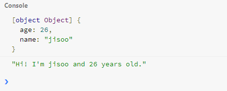

## 5강. 클래스와 오브젝트의 차이 (Class vs Object)

---

### 5-1. 클래스 (Class)

  클래스는 객체(Object)를 생성하기 위한 템플릿이다. 연관 있는 데이터를 묶을 때 사용된다. 즉, 클래스는 실제 데이터값을 갖는것이 아니다. 객체가 클래스 안에 실제 데이터를 저장한다.

  #### 5-1-1. Class 선언

  클래스를 선언하기 위해선 먼저 `class` 로 선언을 해주어야 한다. 아래 예문을 보자

  ```javascript
    class rectangle {
      constructor (height, width) {
        this.height = height;
        this.width = width;
      }
    }

    const rect = new rectangle(10,20);

    console.log(`This rectangle's height is ${rect.height} and width is ${rect.width}`);
  ```
  

  위에서 `constructor` 은 `class` 에서 객체를 생성하고 초기화 하기위한 특별한 메소드이다.

  클래스는 크게 속성(field)와 행동(method) 로 나눌 수 있다. 속성은 클래스를 이루는 객체들이고 행동은 클래스에서 실행되는 함수들이 주를 이룬다.

  ```Javascript
   class person {
     //constructor
     constructor (name, age) {
       //fields
       this.name = name;
       this.age = age;
     }
     //method
     speak() {
       console.log(`Hi! I'm ${this.name} and ${this.age} years old.`);
     }
   }

   const jisoo = new person ('jisoo',26);
   console.log(jisoo);
   jisoo.speak();
  ```
  

  
