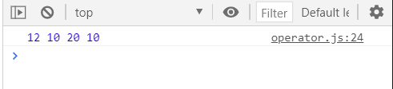
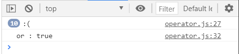
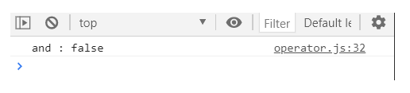
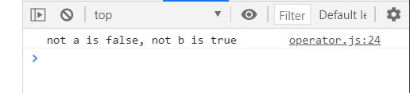
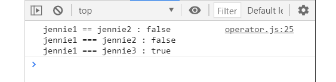
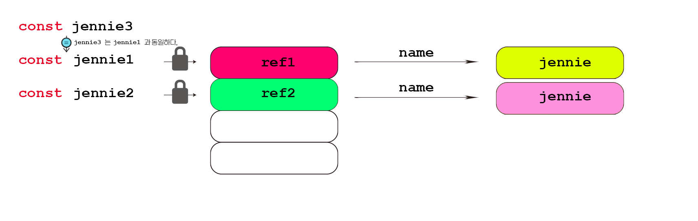
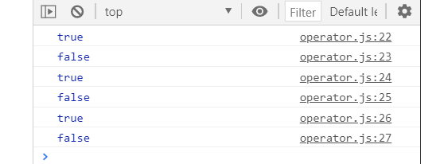

## 3강. 연산자(Operator)와 반복문(if, for loop)
---


### 3-1. 2강 부연설명

#### 3-1-1. variable vs constant

`변수(variable)` 은 rw (read/write)로 메모리에 값을 읽고 쓰는것이 가능하다. 반대로 `상수(constant)` 는 r(read only)로 읽기만 가능하다.


따라서 변수가 계속해서 재할당 될 이유가 없다면 (실제로도 그런 변수가 드물다고 함) `const` 를 이용해서 선언하는 습관을 갖자!

#### 3-1-2. 객체(Object)

`객체(Object)` 의 크기는 너무 커서 메모리에 한번에 할당되지 않는다. 그래서 `object` 로 선언된 변수는 먼저 하나의 `reference` 에 저장된다. 이 `reference` 는 실제로 `object` 가 있는곳을 가리킨다.

 즉, `object` 로 선언된 변수가 저장된 `reference` 를 가리키는 포인터는 잠겨서 다른 `object` 로 변경이 불가능 하지만 `reference` 에 저장된 데이터 값들은 변경이 가능하다.

 

 <br>

 ### 3-2. 연산자(Operator)

 * #### __String concatenation ( `+`, `.concat()`. String Literals )__
 ``` Javascript
 let a = 'black';
 let b = 'pink';
 console.log(a + b);
 console.log(a.concat(b));

 // 숫자를 string 으로 변환
 console.log('1' + 2);

 // String Literals 내에선 ${}이 없으면 문자열이 된다.
 console.log(`Value = ${a}${b}, console.log(a)`);  

// 백슬래시 (\)를 이용해 특수한 표현이 가능하다.
 console.log("it's me,\nMario!");     // \n 은 다음줄로 넘기기
 ```
 


* #### Numeric Operators
  * ##### + (덧셈)
  * ##### - (뺄셈)
  * ##### / (나눗셈)
  * ##### * (곱셈)
  * ##### % (나머지)
  * ##### ** (제곱근)
``` javascript
  let a = 10;
  let b = 2;
  console.log(a+b, a-b, a/b, a*b, a%b, a**b);
```
 


* #### Increment and Decrement Operators
  * ##### Increment (Preincrement, Postincrement)

  ```Javascript
    let counter = 3;
    const preIncrement = ++counter;
    console.log(`preIncrement: ${preIncrement}, counter: ${counter}`)

    // counter = counter + 1
    // preIncrement = counter
  ```
  

    <br>

  ```Javascript
    let counter = 3;
    const postIncrement = counter++;
    console.log(`postIncrement: ${postIncrement}, counter: ${counter}`)

    // postIncrement = counter
    // counter = counter + 1
  ```
  

  <br>

  * ##### Decrement (Predecrement, Postdecrement)

  ```Javascript
    let counter = 3;
    const preDecrement = --counter;
    console.log(`preDecrement: ${preDecrement}, counter: ${counter}`)

    // counter = counter - 1
    // preDecrement = counter
  ```
  

    <br>

  ```Javascript
    let counter = 3;
    const postDecrement = counter--;
    console.log(`postDecrement: ${postDecrement}, counter: ${counter}`)

    // postDecrement = counter
    // counter = counter - 1
  ```
  

  * ##### Assignment Operators

    * __x += y__ : x = x + y
    * __x -= y__ : x = x - y
    * __x *= y__ : x = x * y
    * __x /= y__ : x = x / y

    ``` javascript
    let x = 10;
    let y = 2;


    console.log((x += y), (x -= y), (x *= y), (x /= y));
    // x가 차례대로 새로 할당 되기 때문에 12, 8, 20 ,5 가 아니다.
    ```
    

  * ##### Comparison Operators

    * __<__ : 미만
    * __<=__ : 이하
    * __>__ : 초과
    * __>=__ : 이상

    ```Javascript
      console.log(10<6);
      console.log(10<=6);
      console.log(10>6);
      console.log(10>=6);
    ```
    

  * ##### Logical Operators

    * __|| (or)__ : 하나라도 `true` 라면 `true`로 연산한다.

    ```Javascript
    const value1 = false;
    const value2 = 4 < 2;
    function check() {
      for (let i = 0; i < 10; i++) {
        console.log(":(");
      }
      return true;
    }
    console.log(`or : ${value1 || value2 || check()}`);    
    ```
    
    `check()` 함수로 10번동안 `:(` 도출되고, `i` 가 11이 되어 `true` 가 리턴되었다. 이로인해 `value1` 과 `value2` 가 `false`임에도 `check()` 가 `true` 이기 때문에 결과적으로는 `true` 가 연산된다.
    <br>

    * __%% (and)__ : 하나라도 `false` 면 `false` 로 연산한다.

    ```javascript
    const value1 = false;
    const value2 = 1 < 2;
    function check() {
      for (let i = 0; i >= 0; i++) {
        return true;
      }
      return false;
    }
    console.log(`and : ${value1 && value2 && check()}`);
    ```
      

      `&&` 는 `nullable object` 를 만들 때 쓰이기도 한다.
      <br>

    * __! (not)__ : 연산된 값을 반대로 도출한다.
    ```Javascript
     const a = true;
     const b = false;
     console.log(`not a is ${!a}, not b is ${!b}`);
    ```
      
      <br>
  * ##### Equality
    * __==__ : Loose Equality, with type conversion
    ``` javascript
      let a = 4 ;
      let b = '4';
      console.log(a == b);
    ```
    위와 같이 `let a` 는 `number` 이고 `let b` 는 `string` 이지만 `number` 로 타입변환이 일어나 `true` 로 결과값이 나온다.
  <br>
    * _===_ : Strict Equality, No type conversion
    ``` javascript
      let a = 4 ;
      let b = '4';
      console.log(a === b);
    ```
    이 경우 `===` 연산은 타입변환이 일어나지 않기 때문에 `let a` 와 `let b` 의 타입이 서로 달라 `false` 로 결과값이 나온다.
  <br>
    * Object equality by reference
    ```javascript
    const jennie1 = { name: "jennie" };
    const jennie2 = { name: "jennie" };
    const jennie3 = jennie1;
    console.log(
    `jennie1 == jennie2 : ${jennie1 == jennie2}\n
    jennie1 === jennie2 : ${jennie1 === jennie2}\n
    jennie1 === jennie3 : ${jennie1 === jennie3}`);
    ```
      

    이전에 설명되었듯이, 객체로 저장된 변수는 먼저 각각의 `reference` 마다 변수를 저장하고, 그 `reference` 속에 정보들이 저장된다. 그러므로 `jennie1` 과 `jennie2` 의 내용물이 같더라도 각각 다른 `reference` 에 저장되는 것이기에 서로 다른것으로 판단된다. `jennie3` 는 아예 `jennie1` 과 같기에 같은 `reference` 를 갖게되므로 그 둘은 서로 같다.
      
    <br>
    * Equality Test !

    ```javascript
      console.log(0 == false);
      console.log(0 === false);
      console.log('' == false);
      console.log('' === false);
      console.log(null == undefined);
      console.log(null === undefined);
    ```
      
    기본적으로 `0`, `false`, `''`, `null`, `undefined` 모두 타입은 다르지만 `false` 값을 갖는다.
    따라서 `==` 연산의 경우 타입변환이 이루어지기에 `true`가 된다.
    `===` 연산의 경우 타입변환이 이루어 지지 않아 서로 타입이 다르기에 `false` 이다.
