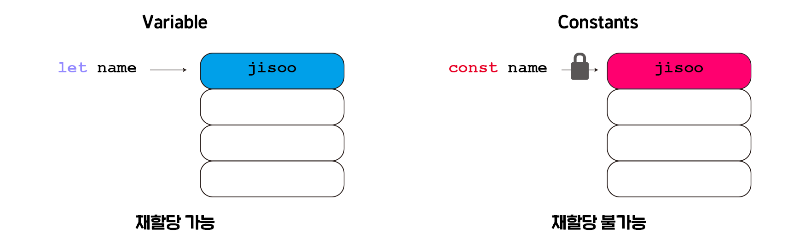
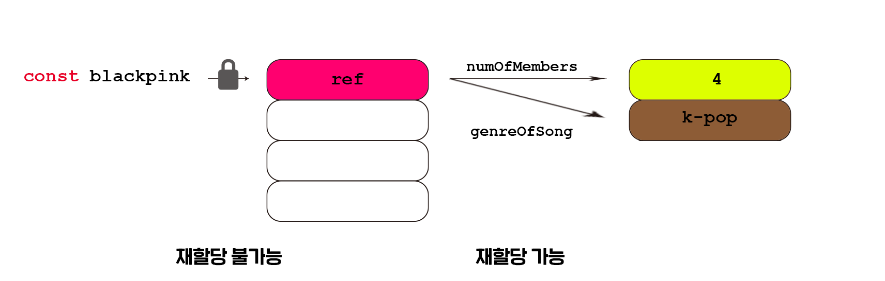
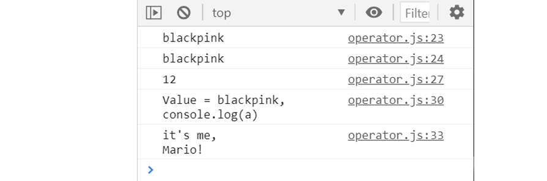
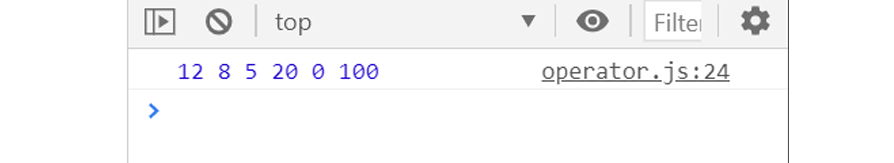
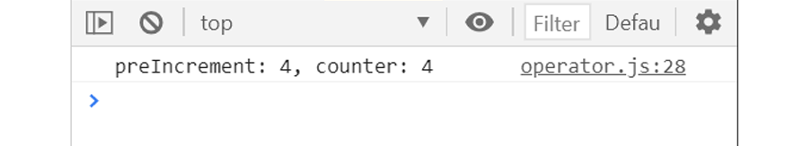
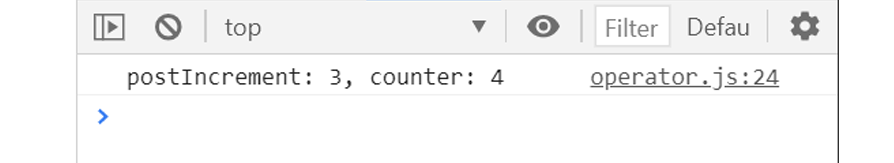
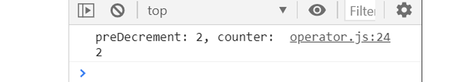
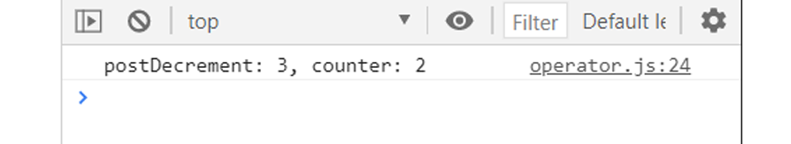

## 3강. 연산자(Operator)와 반복문(if, for loop)
---


### 3-1. 2강 부연설명

#### 3-1-1. variable vs constant

`변수(variable)` 은 rw (read/write)로 메모리에 값을 읽고 쓰는것이 가능하다. 반대로 `상수(constant)` 는 r(read only)로 읽기만 가능하다.



따라서 변수가 계속해서 재할당 될 이유가 없다면 (실제로도 그런 변수가 드물다고 함) `const` 를 이용해서 선언하는 습관을 갖자!

#### 3-1-2. 객체(Object)

`객체(Object)` 의 크기는 너무 커서 메모리에 한번에 할당되지 않는다. 그래서 `object` 로 선언된 변수는 먼저 하나의 `reference` 에 저장된다. 이 `reference` 는 실제로 `object` 가 있는곳을 가리킨다.

 즉, `object` 로 선언된 변수가 저장된 `reference` 를 가리키는 포인터는 잠겨서 다른 `object` 로 변경이 불가능 하지만 `reference` 에 저장된 데이터 값들은 변경이 가능하다.

 

 <br>

 ### 3-2. 연산자(Operator)

 * #### __String concatenation ( `+`, `.concat()`. String Literals )__
 ``` Javascript
 let a = 'black';
 let b = 'pink';
 console.log(a + b);
 console.log(a.concat(b));

 // 숫자를 string 으로 변환
 console.log('1' + 2);

 // String Literals 내에선 ${}이 없으면 문자열이 된다.
 console.log(`Value = ${a}${b}, console.log(a)`);  

// 백슬래시 (\)를 이용해 특수한 표현이 가능하다.
 console.log("it's me,\nMario!");     // \n 은 다음줄로 넘기기
 ```
 


* #### Numeric Operators
  * ##### + (덧셈)
  * ##### - (뺄셈)
  * ##### / (나눗셈)
  * ##### * (곱셈)
  * ##### % (나머지)
  * ##### ** (제곱근)
``` javascript
  let a = 10;
  let b = 2;
  console.log(a+b, a-b, a/b, a*b, a%b, a**b);
```
 


* #### Increment and Decrement Operators
  * ##### Increment (Preincrement, Postincrement)

  ```Javascript
    let counter = 3;
    const preIncrement = ++counter;
    console.log(`preIncrement: ${preIncrement}, counter: ${counter}`)

    // counter = counter + 1
    // preIncrement = counter
  ```
  

    <br>

  ```Javascript
    let counter = 3;
    const postIncrement = counter++;
    console.log(`postIncrement: ${postIncrement}, counter: ${counter}`)

    // postIncrement = counter
    // counter = counter + 1
  ```
  

  <br>

  * ##### Decrement (Predecrement, Postdecrement)

  ```Javascript
    let counter = 3;
    const preDecrement = --counter;
    console.log(`preDecrement: ${preDecrement}, counter: ${counter}`)

    // counter = counter - 1
    // preDecrement = counter
  ```
  

    <br>

  ```Javascript
    let counter = 3;
    const postDecrement = counter--;
    console.log(`postDecrement: ${postDecrement}, counter: ${counter}`)

    // postDecrement = counter
    // counter = counter - 1
  ```
  
