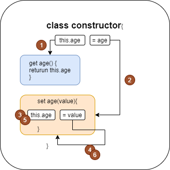

# Javascript class 정리

# 1. Class 기본 내용 정리

## 1. Class

Class 란 Object를 담는 그릇이라고 생각하면 편하다. 객체 지향 프로그래밍에서 Object를 묶어 주는 역할을 하는 것이 Class 이다. javascript 에서는 기본적으로 Class 라는 것이 존재하지 않는다. 하지만 ESMA 6 이후 prototype 이라는 javascript 가 제공하는 기능으로 Class 처럼 동작할 수 있도록 만들어 주었다. Class 라는 기능이 따로 존재하는 다른 언어와는 차이가 있다.

### 1. Class Declaration

**[SOURCE]**

```javascript
class Person{
    constructor(name, age){
        this.name=name;
        this.age=age;
    }
    speak(){
        console.log(`${this.name} : hello!`);
    }
}

const jeahun = new Person('jeahun', 24);
console.log(jeahun.name);
console.log(jeahun.age);
jeahun.speak();
```

**[CONSOLE]**

```
jeahun
24
jeahun : hello!
```

### 2. Getter & Setter

Get 과 Set 은 Class 를 사용할 떄 특정한 정보를 private 하게 지켜야 하거나 정보를 처리할 때 특정한 조건을 줘야할 때 사용한다.

**[SOURCE]**

```javascript
class User{
    constructor(firstName, lastName, age){
        this.firstName=firstName;
        this.lastName=lastName;
        this.age=age;
    }
    get age(){
        return this.age;
    }
    set age(value){
        if(value < 0){
          throw Error('age value is not allow negative number')
        }
        this.age=value;
    }
}


const user1 = new User('Jeahun', 'Sung', -1)
console.log(user1.age);
```

**[CONSOLE]**

```
RangeError: Maximum call stack size exceeded
    at User.set age [as age] (D:\javascript\javascriptStudy\javascriptStudyByDRCD\additionalCodeFiles\class.js:14:17)
    at User.set age [as age] (D:\javascript\javascriptStudy\javascriptStudyByDRCD\additionalCodeFiles\class.js:14:17)
    at User.set age [as age] (D:\javascript\javascriptStudy\javascriptStudyByDRCD\additionalCodeFiles\class.js:14:17)
    at User.set age [as age] (D:\javascript\javascriptStudy\javascriptStudyByDRCD\additionalCodeFiles\class.js:14:17)
    at User.set age [as age] (D:\javascript\javascriptStudy\javascriptStudyByDRCD\additionalCodeFiles\class.js:14:17)
    at User.set age [as age] (D:\javascript\javascriptStudy\javascriptStudyByDRCD\additionalCodeFiles\class.js:14:17)
    at User.set age [as age] (D:\javascript\javascriptStudy\javascriptStudyByDRCD\additionalCodeFiles\class.js:14:17)
    at User.set age [as age] (D:\javascript\javascriptStudy\javascriptStudyByDRCD\additionalCodeFiles\class.js:14:17)
    at User.set age [as age] (D:\javascript\javascriptStudy\javascriptStudyByDRCD\additionalCodeFiles\class.js:14:17)
    at User.set age [as age] (D:\javascript\javascriptStudy\javascriptStudyByDRCD\additionalCodeFiles\class.js:14:17)
```

우리가 원하는 동작은 `age` 라는 변수가 음수면 에러메시지를 띄우는 것이다. 하지만 위의 console 의 결과값을 보면 call stack 이 최대보다 넘어 섰다는 뜻의 오류문구가 나왔다. 이러한 오류는 get 과 set 의 동작구조에 의해 발생한다.

```javascript
constructor(firstName, lastName, age){
    this.firstName=firstName;
    this.lastName=lastName;
    this.age=age;
}
get age(){
    return this.age;
}
set age(value){
    if(value < 0){
        throw Error('age value is not allow negative number')
    }
    this.age=value;
}
```

이 부분에서 `get age`와 `set age`가 선언되는 순간 `this.age=age` 라는 라인의 동작구조가 달라진다. 원래의 동작구조는 메모리에 올라가 있는 `this.age` 를 가져와야 한다. 하지만 `get`과 `set`이 선언되는 순간 밑의 순서를 따라 동작한다.

1. `get` 이 선언 될 때 `this.age`는 메모리가 아닌 `get`을 먼저 호출한다.
2. `=age`, 즉 값을 할당할 때 역시 메모리에서 값을 가져오는 것이 아닌 `set`을 먼저 호출한다.
3. `set age()`가 호출 당했을 때 `this.age=value` 라는 코드가 실행된다.
4. `value`를 `this.age`에 할당할 때 위의 2. 의 과정과 마찬가지로 값을 할당하는 과정이므로 `set` 을 호출(set age() 를 호출)한다.
5. `set` 을 호출하면 다시 `this.age=value;` 코드를 실행한다.
6. **3.~5. 까지의 과정**을 **무한으로 반복**하게 되어서 callstack exceeded가 뜬 것이다.



이러한 문제는 this.age 라는 코드가 constructor 라는 클래스와 get age(), set age() 라고 하는 함수에서 구분 없이 쓰여서 그렇다. 이 문제는 get과 set 함수에서 쓰이는 변수를 다르게 해 줌으로써 해결이 가능하다.

**[SOURCE]**

```javascript
class User{
    constructor(firstName, lastName, age){
        this.firstName=firstName;
        this.lastName=lastName;
        this.age=age;
    }
    get age(){
        return this.age_private;
    }
    set age(value){
        if(value < 0){
            throw Error('age value is not allow negative number')
        }
        this.age_private=value;
    }
}


const user1 = new User('Jeahun', 'Sung', -1)
console.log(user1.age);
```

**[CONSOLE]**

```
Error: age value is not allow negative number
```

위의 소스에서 constructor가 쓰는 age라는 변수를 get과 set 에서 age_private 을 쓰므로서 명확히 구분을 줌으로써 해결을 했다.

### 3. Public & Private

java 나 cpp 같은 프로그래밍 언어에서 지원하는 Public, Private 개념을 javascript에서도 지원을 한다. 하지만 이러한 기능을 js 에서 지원한 것은 최근의 일이므로 많은 브라우저에서 지원을 하지 않으므로 호환성을 생각하면서 사용하여야 한다.

**[SOURCE]**

```javascript
class Experiment {
    publicField = 2;
    #privateField = 0;
}

const experiment = new Experiment();
console.log(experiment.publicField);
console.log(experiment.privateField);
```

**[CONSOLE]**

```
2
undefined
```

### 4. static

static 은 class 자체에 할당하는 프로퍼티나 메소드로서 클래스를 통해 객체를 만들었을 때 객체에서는 접근이 불가하고 class 를 통해서만 접근이 가능하다.

**[SOURCE]**

```javascript
class Article {
    static publisher = 'Dream Coding'
    constructor(articleNumber){
        this.articleNumber=articleNumber;
    }

    static printPublisher(){
        console.log(Article.publisher);
    }
}

const article1 = new Article(1);
const article2 = new Article(2);

console.log(article1.publisher);
console.log(Article.publisher);
```

**[CONSOLE]**

```
undefined
Dream Coding
```

위의 코드를 보면 `article1` 이라는 객체에서 `publisher` 를 호출하면 `undefined` 가 뜨는 것을 확인 할 수 있다. 이는 `publisher` 가 class 에만 소속되어 있기 때문인데 `publisher` 에 접근하려면 클래스 자체에 접근하여 사용하면 된다. 즉 `Article.publisher` 로 출력을 하면 정상적으로 동작한다. 이러한 static은 class 내에서 Object 와 상관없이 사용되는 메소드나 프로퍼티를 정의하고 사용할 때 사용한다.

### 5. inheritance of Class

어떠한 기능을 만들 때 반복적으로 사용되는 기능이 존재할 수 있다. 이러한 기능들을 class 로 만들어 놓고 그 기능들을 상속시켜 다른 class 를 만들어서 사용한다면 유지보수가 쉽고, 소스타이핑 하는 시간을 줄일 수 있다. </br>
밑에서는 어떠한 도형들의 넓이와 그 색을 알아내는 코드를 만든다고 생각해 보자.

**[SOURCE]**

```javascript
class Shape {
    constructor(width, height, color){
        this.width = width;
        this.height = height;
        this.color = color;
    }

    draw(){
        console.log(`drawing ${this.color} color of`);
    }
    getArea(){
        return this.width * this.height
    }
}

class Rectangle extends Shape {}
class Triangle extends Shape {}

const rectangle = new Rectangle(20, 20, 'blue');
rectangle.draw();
const triangle = new Triangle(20, 20, 'red');
tirangle.draw();
```

**[CONSOLE]**

```
drawing blue color of
drawing red color of
```

위의 소스처럼 extends 를 통해 Shpae 이라는 class 를 rectangle, triangle 에 상속시키면 Shape이라는 코드를 2번이나 줄일 수 있다. 이러한 기능 외에도 만약 `drawing red(blue) color of` 를 `drawing red(blue) color!` 로 수정하고 싶으면 Shape의 draw() 메소드만 수정하면 모두 바뀌게 된다. 이러한 것이 상속의 장점이다. 밑의 소스를 참고하라

**[SOURCE]**

```javascript
class Shape {
    constructor(width, height, color){
        this.width = width;
        this.height = height;
        this.color = color;
    }

    draw(){
        console.log(`drawing ${this.color} color!`);
    }
    getArea(){
        return this.width * this.height
    }
}

class Rectangle extends Shape {}
class Triangle extends Shape {}

const rectangle = new Rectangle(20, 20, 'blue');
rectangle.draw();
const triangle = new Triangle(20, 20, 'red');
tirangle.draw();
```

**[CONSOLE]**

```
drawing blue color!
drawing red color!
```

또한 위의 소스에서 직사각형과 삼각형의 넓이를 구하는 공식이 다르다. 이러한 부분 또한 상속을 사용할 때의 다양성을 통해 수정이 가능하다.

**[SOURCE]**

```javascript
class Shape {
    constructor(width, height, color){
        this.width = width;
        this.height = height;
        this.color = color;
    }

    draw(){
        console.log(`drawing ${this.color} color of`);
    }
    getArea(){
        return this.width * this.height
    }
}

class Rectangle extends Shape {}
class Triangle extends Shape {
    getArea(){
        return(this.width * this.height) / 2;
    }
}

const rectangle = new Rectangle(20, 20, 'blue');
rectangle.draw();
console.log(rectangle.getArea());

const triangle = new Triangle(20, 20, 'red');
triangle.draw();
console.log(triangle.getArea());
```

**[CONSOLE]**

```
drawing blue color of
400
drawing red color of
200
```

위의 소스에서 `class Triagle extends Shape` 부분만 보자

```javascript
class Triangle extends Shape {
  getArea(){
    return (this.width * this.height) / 2;
  }
}
```

원래의 `getArea()` 메소드는 `this.width*this.height` 였는데 `class Triangle` 에서 `(this.width * this.height) / 2` 로 수정하여 사용할 수 있도록 하였다. 이러한 기능을 **Overriding** 이라고 하며 원래의 기능 외에 기능을 추가하거나 기능을 변경할 때 사용한다. 단 주의할 것은 이러한 overriding 을 사용하면 원래의 기능을 상실한다. overriding을 하되 원래의 기능도 유지해야 할 때 `super` 를 사용한다. 아래를 참고하라.

**[SOURCE]**

```javascript
class Shape {
    constructor(width, height, color){
        this.width = width;
        this.height = height;
        this.color = color;
    }

    draw(){
        console.log(`drawing ${this.color} color of`);
    }
    getArea(){
        return this.width * this.height
    }
}

class Rectangle extends Shape {}
class Triangle extends Shape {
    draw(){
        console.log('△');
    }
    getArea(){
        return(this.width * this.height) / 2;
    }
}

const rectangle = new Rectangle(20, 20, 'blue');
rectangle.draw();
console.log(rectangle.getArea());

const triangle = new Triangle(20, 20, 'red');
triangle.draw();
console.log(triangle.getArea());
```

**[CONSOLE]**

```
drawing blue color of
400
△
200
```

위의 `class Triangle` 안에서 `draw()` 로 overrinding 을 했다. 이 때 `drawing red color of` 가 출력되지 않는다. 만약 `drawing red color of` 를 출력하고 싶으면 아래의 코드를 `class Trigangle` 부분에 삽입하면 된다.

```javascript
class Triangle extends Shape {
    draw(){
        super.draw();
        console.log('△');
    }
    getArea(){
        return(this.width * this.height) / 2;
    }
}
```

super 는 부모 클래스의 메소드를 자식 클래스의 overriding과는 상관없이 가져와서 사용할 수 있도록 해 준다.

### 6. instanceof(class checking)

instanceof 는 상속관계를 boolean type 으로 도출해 주는 메소드이다. 기본적인 사용법은 아래와 같다.

```javascript
자식객체 instanceof 부모객체//type === boolean
```

우리가 위에서 썼던 소스를 통해 자세히 알아보자.

**[SOURCE]**

```javascript
class Shape {
    constructor(width, height, color){
        this.width = width;
        this.height = height;
        this.color = color;
    }

    draw(){
        console.log(`drawing ${this.color} color of`);
    }
    getArea(){
        return this.width * this.height
    }
}

class Rectangle extends Shape {}
class Triangle extends Shape {
    draw(){
        console.log('△');
    }
    getArea(){
        return(this.width * this.height) / 2;
    }
}

const rectangle = new Rectangle(20, 20, 'blue');
rectangle.draw();
console.log(rectangle.getArea());

const triangle = new Triangle(20, 20, 'red');
triangle.draw();
console.log(triangle.getArea());

console.log('-----------check of instance----------');
console.log(rectangle instanceof Rectangle);
console.log(triangle instanceof Rectangle);
console.log(triangle instanceof Triangle);
console.log(triangle instanceof Shape);
console.log(triangle instanceof Object);
```

**[CONSOLE]**

```
drawing blue color of
400
△
200
-----------check of instance----------
true
false
true
true
true
```

다른 부분은 위의 소스를 보면서 차근차근 보면 이해할 수 있다. `triangle instanceof Object` 에서 `Object`는 모든 javascript 위에 존재하는 객체이다. 앞에서도 알아보았지만 javascript는 class라는 형태가 존재하는 것이 아니라 객체를 통해 class 의 개념을 만든 것이기 때문에 클래스도 객체로 본다.
